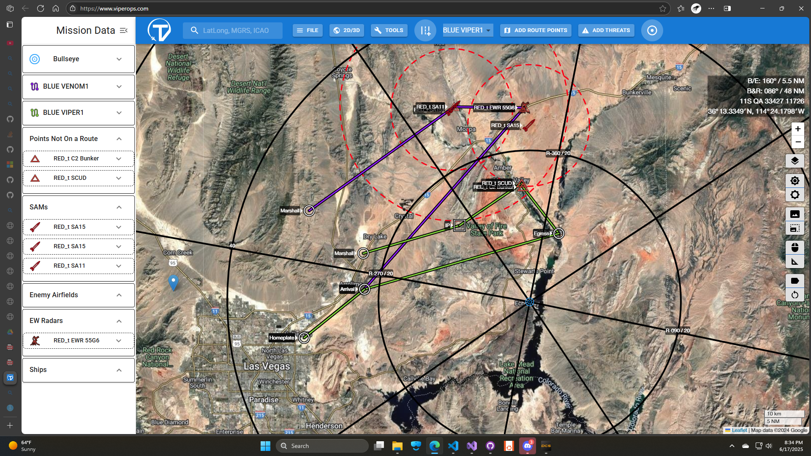
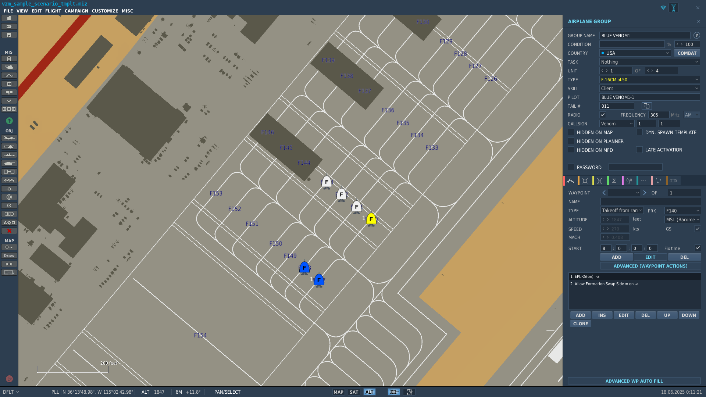
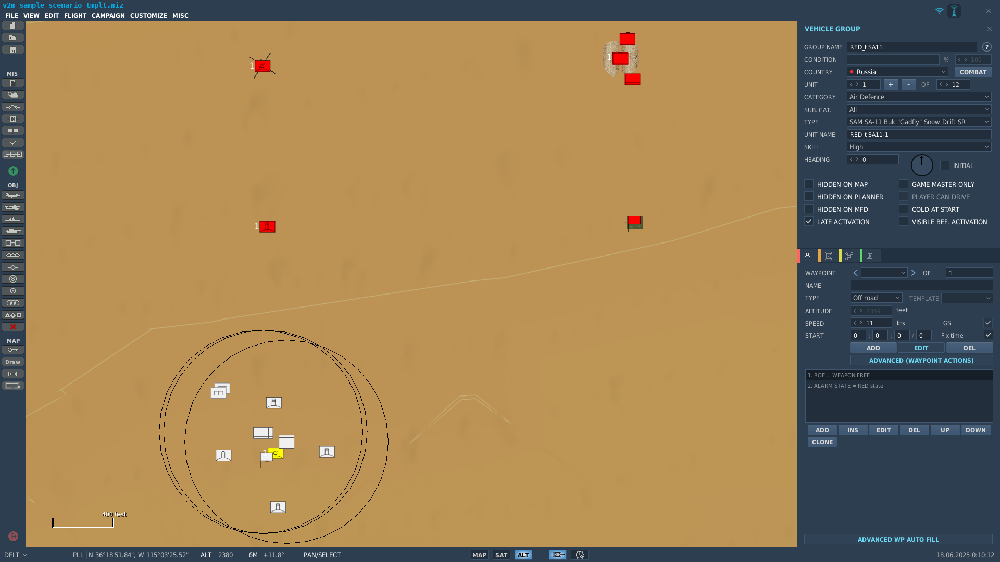
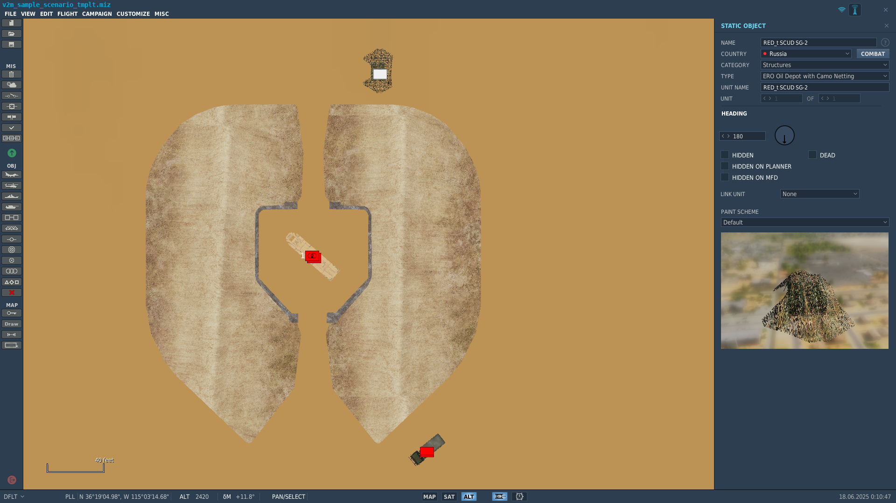
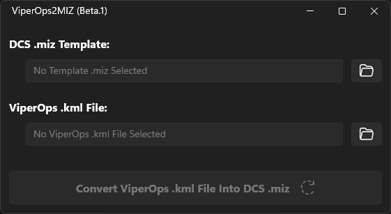

# ViperOps2MIZ: Build DCS Missions from ViperOps

*Version 1.0.0 of TBD*

## Preliminaries

ViperOps2MIZ is a tool to convert a mission set up using
[ViperOps](https://www.viperops.com/)
into a DCS `.miz` mission. It does this by taking the `.kml` export of a ViperOps
mission and, with the help of a template `.miz`, creating a new DCS `.miz` matching
the ViperOps setup.

### Installing & Updating

> TODO: Installer is currently WIP.

A Windows `.msi` installation package for ViperOps2MIZ is available
[here](https://github.com/51st-Vfw/ViperOps2MIZ/releases).
Installation is easy and places a shortcut to ViperOps2MIZ on your desktop,

1. Download the `.msi`
2. Double-click the `.msi`

You may also build and install ViperOps2MIZ from source by cloning the
[ViperOps2MIZ repository](https://github.com/51st-Vfw/ViperOps2MIZ)
and building the application using Microsoft
[Visual Studio](https://visualstudio.microsoft.com/vs/).
The ViperOps2MIZ solution includes a project for the application itself along with a project
based on the release build that packages the application into a `.msi` file.

To update the application, simply
[uinstall](#uninstalling) it and then re-install from the latest `.msi` package.

### Uninstalling

To uninstall the application, you can use the **Add/Remove Programs** function in Windows to
remove the application itself. After doing so, you may safely remove the `ViperOps2MIZ`
directory in your `Program Files\51stVFW` directory.

### Troubleshooting

Sometimes stuff goes wrong. If ViperOps2MIZ is crashing, one thing to try is uninstalling
just the ViperOps2MIZ application and then re-install it from a fresh `.msi`, as if you
were updating the application as
[described earlier](#installing--updating)

ViperOps2MIZ uses the *Segoe Fluent Icons* font from Microsoft. If this font is not installed
on your system, icons in the ViperOps2MIZ UI may appear as boxes. To restore the icons,

1. Download the *Segoe Fluent Icons* font from Microsoft from the link on
   [this page](https://learn.microsoft.com/en-us/windows/apps/design/downloads/#fonts).
2. Right click the `.zip` file downloaded in step 1 and select "Extract" to unpack the `.zip`
   file.
3. In the extracted files, right-click on the `Segoe Fluent Icons.ttf` file and select
   "Install" or "Install for all Users" from the context menu.
4. Restart your system.

You only need to perfom these steps if simple square boxes show up as icons in the UI.

## Using ViperOps2MIZ

To use ViperOps2MIZ,

1. Build out the scenario in
   [ViperOps](https://www.viperops.com/)
   following the conventions
   [described below](#building-the-example-scenario-in-viperops).
2. Export the scenario from
   [ViperOps](https://www.viperops.com/)
   as a `.kml` file using `Export to KML` on the `File` button in ViperOps.
3. Generate a DCS `.miz` template for the scenario using your own template or a
   [prebuilt template](#pre-built-templates)
   following the conventions
   [described below](#a-template-for-the-scenario).
4. Run ViperOps2MIZ and supply the `.kml` and template `.miz` to create a final `.miz`.
5. You can edit the final `.miz` in DCS Mission Editor if you need to make adjustements.

To illustrate how ViperOps2MIZ works, we will work through an example.

### An Example Scenario

The example we will use is based on a simple strike/SEAD scenario. There are two blue
groups based out of Nellis AFB,

- VENOM1 (SEAD, 4-ship) targets a red SA11 and EWR site.
- VIPER1 (Strike, 2-ship) targets a red C2 bunker and SCUD launcher in Glassand.

The red forces include,

- EWR 55G6 (VENOM1 target)
- SA-11 SAM site (VENOM1 target)
- Two SA-15 SHORADS (providing cover for the EWR and SA-11)
- SCUD Launcher (VIPER1 target)
- C2 Bunker (VIPER1 target)

Blue is tasked with supressing or destroying the SA-11 and EWR sites to enable a strike
on the C2 bunker and mobile SCUD launcher.

### Building the Example Scenario in ViperOps

To build out this scenario in ViperOps, the following types of markers and points are used,

|Scenario Units|ViperOps Marker|ViperOps Marker Names|Matches DCS Groups
|:--:|:--:|:--:|:--:|
| VENOM1, VIPER1 flights   | Route| `BLUE VENOM1`, `BLUE VIPER1` | Aircraft
| EWR 55G6                 | EW Radar Threat     | `RED_t EWR 55G6` | EWR Groups
| SA-11, SA-15 (multiple)  | SAM Threat          | `RED_t SA11`, `RED_t SA15` | S2A Groups
| C2 Bunker, SCUD Launcher | Points Not on Route | `RED_t C2 Bunker`, `RED_t SCUD` | Other Groups, Statics
| Bullseye                 | Bullseye            | None | N/A

"EW Radar" and "SAM" threat markers are used for EWR and SAM ground units, "Points not on a
Route" markers are used for other ground units or static objects, and "Route" is used for
aircraft (with the route specifying the steerpoints). These markers indicate where the final
`.miz` locates units and steerpoints. The name for a marker (set using the pencil icon in
ViperOps) determines which template(s) are located at the marker.

Setting the "Bullseye" in ViperOps determines the location of the blue bullseye in the final
`.miz`.

In ViperOps, the mission for this scenario looks like this,

For reference, the ViperOps file for the example mission scenario is available
[here](doc/v2m_sample_scenario.txt)
and the exported `.kml` is available
[here](doc/v2m_sample_scenario.kml).

### A Template for the Scenario

The template provides example(s) of each unique unit in the mission scenario. It includes
groups for each **distinct** (in terms of type, coalition, unit composition and layout,
actions, etc.) unit from the scenario. For example, the template for the example scenario
would only need one SA-15 template for the two SA-15 units that are in the scenario. The
groups from the template are used to generate the units from the ViperOps scenario.

> The template may also contain other units that are not included in the ViperOps mission.
> These units will appear in the final `.miz` as-is.

Templates may be shared by multiple scenarios. This section provides an overview of how
templates are set up. The repository also contains a number of pre-built templates as
described
[below](#pre-built-templates).

Groups in the template...

- May be aircraft, ground vehicles, or statics.
- May contain of multiple units.
- Are matched with a unit from the ViperOps mission by their group or static name. Generally,
  it is suggested adopting a convention that all non-aircraft template names start with either
  "`RED_t`" or "`BLUE_t`".
- Should be marked for **Late Activation** in the DCS Mission Editor (for ground units).
- Should be set up at their departure airbase with the appropriate takeoff type and skill in
  the DCS Mission Editor (for aircraft).
- Should not contain any waypoints.
- May use actions in Waypoint 0 to configure AI (e.g., alert state, ROE, etc.).
- May be located anywhere on the map.

The final `.miz` preserves settings other than groups from the template. The weather,
time of day, triggers, coalitions, settings, and so on will match those in the template.

In the example mission scenario, we will need two F-16C flights for blue, an EWR 55G6, an
SA-11 SAM, an SA-15 SHORADS, and a SCUD ground groups along with a C2 bunker static for red.

Aircraft are positioned at their initial starting bases on the ramp as shown here,

The two flights on the ramp are VENOM1 (selected) and VIPER1. These groups are placed in
their desired starting location with a "takeoff" type and no waypoints. The name of the
group and its units should be consistent with the name of a route from the ViperOps scenario.
At build time, ViperOps2MIZ populates the waypoints for an air group with the route with a
mtaching name from the `.kml`. Here, the group for VENOM1 ("`BLUE VENOM1`) will get waypoints
from the `BLUE VENOM1` route in the `.kml`. All settings of the flights, such as the skill,
callsign, loadout, avionics configurations, etc. are preserved and can be set up in the
template.

The ground units and statics are positioned anywhere in the theater as shown here,

The location of the template groups is not important as ViperOps2MIZ will relocate the
groups to their proper location consistent with the `.kml` file. When a group has multiple
units, ViperOps2MIZ preserves the relative position of the units when building the group at
the location a marker specifies. The selected group, `RED_t SA11` will be placed at the
location of each marker in the `.kml` with the name `RED_t SA11`.

Ground templates function similar to flights: group names should match the name of a marker
from ViperOps. Multiple markers can share the same name. For example, both `RED_t SA15`
markers in the scenario share the same `RED_t SA15` template group (ViperOps2MIZ makes copies
as necessary). Like flights, the settings, such as the skill, callsign, loadout, avionics
configurations, waypoint 0 actions, heading, etc. are preserved and can be set up in the
template.

Template groups should always be marked as **Late Activation**.

> You can always create different templates for the same type of unit. For example, you could
> have multiple templates for an SA-11 SAM site that differ in the number of TELs, layout
> of the units that make up the site, orientation, etc.

> Templates need **not** be specific to a given scenario and need **not** only include those
> units a particular `.kml` requires. As a result, you could build a template with one of
> each kind of SAM (for example) that could be used to build out multiple scenarios in a
> particular theater with different IADS setups.

Ground templates can optionally have associated statics. For example, you can place TELs
from a SAM site template in revetments. Whenever ViperOps2MIZ copies a group template to
the final `.miz`, it will also copy any associated statics. Consider the SCUD template from
the sample mission,

The SCUD template group, `RED_t SCUD`, includes two units: a SCUD launcher along with a
support truck. Associated with this template group are static objects for a revetment and an
oil deopt. The group name establishes the association. Generally, a static with a group name
that begins with *`<G> SG`* is associated with a group template with the name *`<G>`*. In our
sample mission, the statics associated with the SCUD template group `RED_t SCUD` are named
`RED_t SCUD GS-1` (the revetment) and `RED_t SCUD GS-2` (the oil depot).

A template for this example mission scenario is available
[here](doc/v2m_sample_scenario_tmplt.miz).

### Building the DCS `.miz` File

Once you have the exported `.kml` and template file, ViperOps2MIZ can perform the conversion.
The user interface is straight-forward,

You can use the buttons at the right to select the template `.miz` and exported `.kml` file.
Alternatively, you can drag `.miz` and `.kml` files from Windows Explorer onto the
ViperOps2MIZ window to fill in the fields. Once both files are specified, use the
"Convert..." button to perform the conversion. Before performing the conversion, ViperOps2MIZ
will prompt you for a location for the output `.miz`.

The output `.miz` for this example mission scenario is available
[here](doc/v2m_sample_scenario_final.miz).

Once the mission has been generated, you may want to open it in DCS Mission Editor to verify
the conversion was successful or make other changes (updating weather, time of day, etc.) to
the mission. During these checks, you can delete templates from the final `.miz`.

## Pre-Built Templates

The repository includes sample templates in the
[`templates`](templates)
directory,

| File | Map |
|:----:|:---:|
| `v2m_tmplt_nevada.miz` | Nevada NTTR

Each template includes friendly aircraft at several bases and a basic set of templates for
red IADS and target objects. The units and their group names are common across the templates
and include,

| Name | DCS Group |
|:----:|:---------:|
| `BLUE VENOM1`       | F-16C 4-ship
| `BLUE VIPER1`       | F-16C 4-ship
| `RED_t Bunker`      | Structures / Command Center static
| `RED_t Warehouse`   | Warehouses / Warehouse static
| `RED_t SCUD`        | SSM SS-1C SCUD-B, KMAZ 43101 Truck
| `RED_t Armor`       | MBT T-90 (x4), IFV BTR-82A (x2)
| `RED_t EWR 55G6`    | EWR 55G6
| `RED_t SA18`        | SA-18 Igla-S (x3), SA-18 Igla-S C2
| `RED_t SA8`         | SAM SA-8 Osa, Ural 4320T
| `RED_t SA13`        | SAM SA-13 Strella, Ural 4320T
| `RED_t SA15`        | SAM SA-15 Tor, Ural 4320T
| `RED_t SA19`        | SAM SA-19 Tunguska, Ural 4320T
| `RED_t SA2`         | SAM SA-2 Battery (DCS Template), Revetments
| `RED_t SA3`         | SAM SA-3 Battery (DCS Template), Revetments
| `RED_t SA5`         | SAM SA-5 Battery (DCS Template), Revetments
| `RED_t SA6`         | SAM SA-6 Battery (DCS Template), Revetments
| `RED_t SA10`        | SAM SA-10 Battery (DCS Template), Revetments
| `RED_t SA11 Fixed`  | SAM SA-11 Battery (DCS Template), Revetments
| `RED_t SA11 Mobile` | SAM SA-11 Battery (DCS Template)

These templates may be used as is or modified to suit your specific scenario.